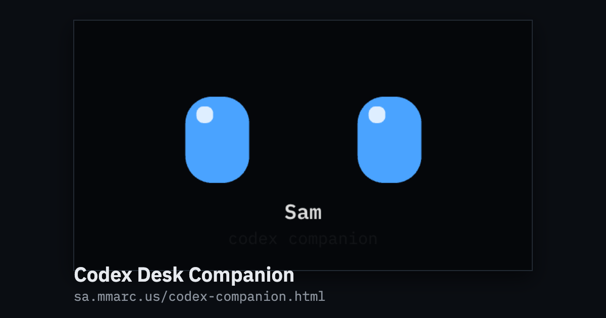

# Codex Desk Companion

A small creature on the end of a USB cable that watches your Codex session and
tells you when it needs you.



That is a render, not a photograph, and it doubles as the link preview image for
the site.

<!-- Still to shoot, and better than the render above:
  docs/media/hero.jpg: the board on a desk, powered, resting face showing, from
  slightly above so the panel is readable and the cable is in frame. Landscape,
  1600px or wider.       
  docs/media/firstrun.gif: the 9.25 second first-run sequence in one take, dark
  to settled face, no cuts, looping, under 5MB. Then it plays inline on GitHub.
   -->

It is a LILYGO T-Display-S3: an ESP32-S3 with a 320x170 colour LCD, two buttons
and a native USB port. There are fourteen of them. Every one runs the
byte-identical binary.

- **The device needs none of this.** Plug it into any USB port and it is done.
- **The optional host program, if you want one:** `npx github:sammarcus/codex-companion`
- **One page on what it is:** <https://sa.mmarc.us/codex-companion.html>
- **Source:** <https://github.com/sammarcus/codex-companion>

## Why it exists

A Codex turn can run for ten minutes. Somewhere in the middle of it the agent
stops and asks you a question, and it goes on not working until you notice. This
object is the noticing. When Codex is blocked on you the eyes go wide, the brows
come up, and the whole head hops on an amber pulse until you answer, then leans
on it harder and turns red if you do not. You can read that across a room with
the text illegible and the ring the size of a coin, without switching windows.
That is the one behaviour it exists for. Everything else is what it does with
the rest of its day.

## Plug it in. That is the whole install.

**It needs no software at all.** This is the first design law and every other
decision bends to it. On USB power alone, with nothing on the other end of the
cable, it is a complete object:

- **It wakes up.** The first time it is ever powered it plays a 9.25 second
  out-of-the-box sequence: dark, a light comes up on two shut eyes, they crack
  open, squint, look around, find the person in front of them, blink, wave a
  hand at the room over the words `Hi OpenAI`, and then nod and say whose it is.
  It plays exactly once, and its last second already is the resting
  composition, so the settle is invisible.
  [`firmware/FIRSTRUN.md`](firmware/FIRSTRUN.md).
- **It stays alive.** The resting animation never stops moving and never shows
  an error, a spinner or a "waiting for host" message. It drifts on two sine
  periods that do not divide into each other, so the anti burn-in path never
  retraces. [`firmware/AMBIENT.md`](firmware/AMBIENT.md).
- **It is a desk sign.** Press both buttons: DO NOT DISTURB, in a violet no
  other state owns, with your name under it.
- **It is a toy.** Hold button 1 and the face runs along a line and hops over
  blocks. The best score survives the power cycle.
- **It keeps score, then times you.** One tap on button 1 shows turns today,
  tokens today, the longest turn ever and the best token day, and marks
  milestones as they land. A second tap turns that into a pomodoro at 5, 15, 25
  or 45 minutes, with what Codex is doing alongside it.
- **It has three faces and knows its name.** Both are runtime state on the
  board. Nothing is compiled in.

The fourth design law is that it must never be irritating to sit next to in an
open-plan office, which is why the milestone pill is still after its entrance
and there is no buzzer anywhere in the design. Every gesture, every screen and
every rule about what covers what: [`firmware/README.md`](firmware/README.md).

## The optional host program

`helper/codex-companion.js`. One file, zero dependencies, no build step, no
background service. Node 20 or newer, macOS. It reads state from Codex's own
first-party hook system, not from the screen and not from a heuristic. Two
claims matter more than the rest, and both are provable in under a minute:

- **It can never approve or deny anything.** Two independent mechanisms, either
  sufficient alone: the `PermissionRequest` handler writes nothing to stdout and
  exits 0, and every handler is registered `"async": true`, which Codex will not
  accept a verdict from. The prompt appears in your terminal and you answer it
  there, exactly as you would with this uninstalled.
- **It reads counters, not content.** Two fields of the hook payload
  (`hook_event_name` and `transcript_path`), and out of the session file Codex
  already writes, only lines matching one of eight record-type hints: token
  counts and turn boundaries. Your prompts, the replies, command output and file
  contents are skipped as raw text and never become a JavaScript object. `sub`
  on a `waiting` frame is always the literal string `your turn`.

```bash
npx github:sammarcus/codex-companion            # run it, foreground, Ctrl-C to stop
npx github:sammarcus/codex-companion doctor     # look before you leap
npx github:sammarcus/codex-companion install-hook    # prints the file, then writes it
npx github:sammarcus/codex-companion uninstall-hook  # removes exactly what it added
```

`npx` caches the repository under `~/.npm/_npx` and runs it from there: nothing
goes on your PATH, nothing is installed globally, and there is no build step.
`rm -rf ~/.npm/_npx` removes it. From a clone, `node helper/codex-companion.js
<command>` is the same program.

`install-hook` writes one file, `~/.codex/hooks.json`, merging into whatever is
already there, and Codex will not run a hook it has not been told to trust, so
nothing happens until you approve it at its own "Hooks need review" prompt. Run
the greps yourself: [`docs/verification.md`](docs/verification.md) has every
claim above with the command that settles it. The command surface, including the
nine subcommands that talk to the board with no Codex involved at all, is in
[`helper/README.md`](helper/README.md).

## Build and flash

PlatformIO, three pinned dependencies (`espressif32@7.1.1`,
`lovyan03/LovyanGFX@1.2.28`, `bblanchon/ArduinoJson@7.4.3`), one env, and no
per-unit build: nothing is stamped in at compile time, so the fleet is flashed
from one binary with one hash.

```bash
cd firmware
pio run
pio run -t upload --upload-port /dev/cu.usbmodemXXXX
```

The upload ends in `Hash of data verified`, esptool reading the SHA of what it
just wrote back off the chip, so every flash checks itself.
`firmware/tools/flash-all.sh` does the batch. Both libraries are fetched from
PlatformIO's registry at build time and no copy of either lives here. Recovering
a board that will not enter download mode, monitoring one, and the fleet hash:
[`firmware/README.md`](firmware/README.md).

## The five states

| state | Codex event | on the panel |
|---|---|---|
| `sleep` | none, it is the dark state | the face at rest, no ring |
| `idle` | `SessionStart`, `Interrupt`, `SessionEnd` | a slow breathe on the idle blue |
| `busy` | `UserPromptSubmit`, `PreToolUse`, `PostToolUse` | eyes squint and scan, the ring fills with context used |
| `waiting` | `PermissionRequest` | eyes wide, brows up, the head hops on an amber pulse, red after ten seconds |
| `done` | `Stop` | one green flash, then back to idle |

Newline-delimited JSON over USB CDC at 115200 baud, nineteen fields, any of
which may be omitted, so a delta line is legal and `{}` is a keepalive. A shell
redirect is a complete host:

```bash
printf '{"say":"deploying to prod, do not unplug"}\n' > /dev/cu.usbmodemXXXX
```

Full spec, the staleness ladder, the transmit quirk every consumer has to know
about and worked examples: [`docs/protocol.md`](docs/protocol.md).

## The face system

The face is the whole product, it has been redrawn several times, and it will be
redrawn again, so it is not part of the renderer. It lives behind a four-method
interface, three designs implement it, and which one a board shows is runtime
state you change with a protocol line or an 800ms hold on button 2. Writing a
new one costs one file, three lines in a registry, and no reflash for anybody
else. The interface and the three rules a face may not break are in
[`firmware/FACES.md`](firmware/FACES.md), the default face's geometry and blink
model in [`firmware/EYES.md`](firmware/EYES.md).

## Repo layout

```
codex-buddy/
├── CONTRIBUTING.md        how to build, test and change this repo
├── firmware/              PlatformIO project, env `tdisplays3`
│   ├── src/               main.cpp, the face interface, the three faces
│   ├── tools/             flash-all.sh, sim.py, the fleet log
│   └── README.md, FACES.md, EYES.md, AMBIENT.md, FIRSTRUN.md
├── helper/                codex-companion.js, its tests, its README
├── docs/
│   ├── protocol.md        the formal wire spec, corrected against both ends
│   ├── verification.md    every claim in this file, with the command for it
│   ├── architecture.md    why it is shaped like this, and what got reversed
│   └── NEEDS-EYES.md and open-questions.md, the two lists of what is unsettled
├── site/                  index.html, the one-page site the card points at,
│                         and codex-companion-card.png, its link preview image
└── vendor/                git-ignored: reference clones, never redistributed
```

## Licences

MIT, declared at the repository root in [`LICENSE`](LICENSE) and in both
`package.json` files, so the firmware and the host program are covered by the
same terms. `vendor/` is in `.gitignore` and nothing under it is tracked (`git ls-files
vendor | wc -l` returns 0): shallow clones of openai/codex,
Xinyuan-LilyGO/T-Display-S3, lovyan03/LovyanGFX and
anthropics/claude-desktop-buddy, read while this was written and cited by path
so a claim can be followed to its source. None of their code is redistributed
here. Clone by clone: [`docs/licences.md`](docs/licences.md).

## What is verified, and what is not

**On real hardware.** A board was rebuilt from source, flashed (`Hash of data
verified`), reset and greeted. It accepted and acked hand-written lines for
`state`, `say`, `dnd`, `name` and `face`, reported back its own solved layouts,
and kept an owner name across a hardware reset. All eight hook event frames have
been accepted by a real board, and every frame-cost table here was measured on
one with an `-DFPS_DEBUG` build. **In software**, eleven test files under
`helper/test/` at `fail 0`, plus the `hooks.json` install and uninstall round
trip against a scratch `CODEX_HOME` holding a foreign hook. Both transcribed in
[`docs/verification.md`](docs/verification.md).

**Not verified, and it is the important gap: nobody has judged the screen.**
Every visual claim here is arithmetic that has been rendered but not signed off
by an eye. Whether the face is cute, whether the blink reads as organic rather
than as a shutter, whether `waiting` reads as "hey, you" without being maddening
to sit next to. Those are in [`docs/NEEDS-EYES.md`](docs/NEEDS-EYES.md), a gate
rather than a wishlist.

**Not verified end to end: a real Codex `PermissionRequest` reaching a board.**
Every link has been tested individually and the whole chain has been driven by
the test harness, but never by Codex itself. It is item N6 in
[`docs/open-questions.md`](docs/open-questions.md), where every other unconfirmed
item lives with the command that would settle it, and it is the single most
valuable thing left to do.
